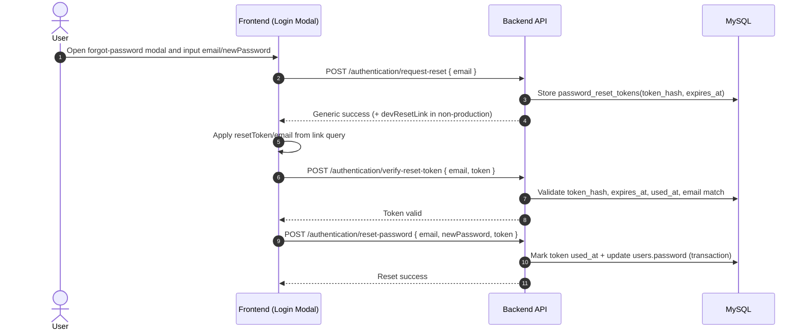

# Modal Forgot Password Flow (Token-Verified)

## Overview

This project uses a modal-based forgot-password flow with reset tokens.

- The reset UI remains a modal in `/signin`.
- Inputs remain two fields: email and new password.
- The actual password update requires a valid reset token.
- Reset tokens are random, SHA-256 hashed in DB, expire in 30 minutes, and are single-use.

## API Contract

| Endpoint | Purpose | Request Body |
| --- | --- | --- |
| `POST /authentication/request-reset` | Create reset token and reset link | `{ "email": "string" }` |
| `POST /authentication/verify-reset-token` | Validate token before reset | `{ "email": "string", "token": "string" }` |
| `POST /authentication/reset-password` | Complete password reset | `{ "email": "string", "newPassword": "string", "token": "string" }` |

## Sequence Diagram

## Backend Mapping

- Routes: `backend/src/routes/authRoutes.ts`
  - `POST /authentication/request-reset`
  - `POST /authentication/verify-reset-token`
  - `POST /authentication/reset-password`
- Controllers: `backend/src/controllers/authController.ts`
  - `requestReset`: creates token hash row and returns generic message.
  - `verifyResetToken`: validates token hash, expiry, single-use, email match.
  - `resetPassword`: verifies token again, consumes token (`used_at`) and updates password in transaction.

## Frontend Mapping

- Modal component: `frontend/src/pages/Login.tsx`
  - No reset token in URL: calls `request-reset`.
  - Token in URL (`resetToken` query): verifies token then calls `reset-password`.
  - Keeps two inputs (email, new password) and modal UX.

## Data Model

- Main user table: `users`
- New reset table: `password_reset_tokens`
  - `token_hash` (SHA-256)
  - `expires_at` (30 min)
  - `used_at` (single-use marker)
  - `user_id` FK to `users.id`
