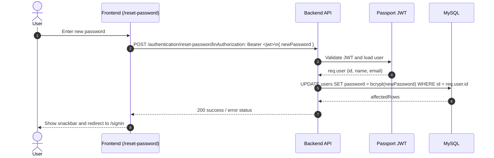

# JWT Reset Password Flow

## Overview

This project uses a JWT-authenticated password reset flow.

- No email lookup is used for resetting password.
- No reset-token table is required.
- The authenticated user is resolved from `Authorization: Bearer <jwt>`.

## Request/Response Contract

| Item | Value |
| --- | --- |
| Endpoint | `POST /authentication/reset-password` |
| Auth | Required (`passport-jwt`) |
| Body | `{ "newPassword": "string" }` |
| Success | `200 { "message": "비밀번호가 성공적으로 변경되었습니다." }` |
| Failure | `400`, `401`, `404`, `500` |

## Sequence Diagram

## Backend Mapping

- Route guard: `backend/src/routes/authRoutes.ts`
  - `router.post('/reset-password', passport.authenticate('jwt', { session: false }), authController.resetPassword)`
- Handler: `backend/src/controllers/authController.ts`
  - Reads `req.user` from JWT auth context.
  - Validates `newPassword` exists.
  - Hashes password via `bcrypt.hash(newPassword, 10)`.
  - Updates by user id (not by email).

## Frontend Mapping

- Route: `frontend/src/App.tsx`
  - Adds `/reset-password` page.
- Entry point from login modal: `frontend/src/pages/Login.tsx`
  - Forgot-password dialog navigates to `/reset-password`.
  - No email/new-password inline reset form.
- Reset screen: `frontend/src/pages/ResetPassword.tsx`
  - Validates inputs and token presence.
  - Calls `/authentication/reset-password` with `newPassword` only.

## Data Model Notes

Only `users.password` is used for this flow.

- `users.id` is the reset target key.
- Reset happens for currently authenticated principal only.
