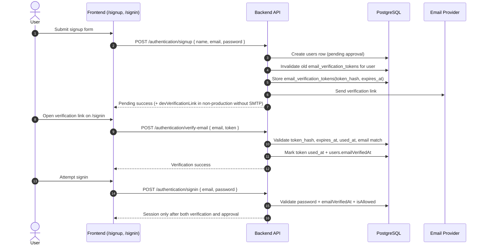

# Signup Email Verification Flow

## Overview

This project now uses email verification for local signup before the existing admin-approval step.

- The signup UI still lives on `/signup` via `frontend/src/pages/login/Login.tsx`.
- Verification links land on `/signin` with query parameters.
- Verification tokens are random, SHA-256 hashed in DB, expire in 3 days, and are single-use.
- Local accounts require both email verification and admin approval before signin succeeds.
- Google/Kakao accounts are treated as verified after provider login, but they still require admin approval.

## API Contract

| Endpoint | Purpose | Request Body |
| --- | --- | --- |
| `POST /authentication/signup` | Create local account and send verification email | `{ "name": "string", "email": "string", "password": "string" }` |
| `POST /authentication/verify-email` | Consume verification token and mark email verified | `{ "email": "string", "token": "string" }` |
| `POST /authentication/resend-verification-email` | Send a fresh verification email for an unverified local account | `{ "email": "string" }` |

## Sequence Diagram

## Backend Mapping

- Routes: `backend/src/routes/authRoutes.ts`
  - `POST /authentication/signup`
  - `POST /authentication/verify-email`
  - `POST /authentication/resend-verification-email`
- Controllers: `backend/src/controllers/authController.ts`
  - `signUp`: creates the local user and triggers email verification delivery.
  - `verifyEmail`: validates token hash, expiry, single-use, and email match.
  - `resendVerificationEmail`: creates a fresh verification token and sends a new email.
- Service layer: `backend/src/services/authService.ts`
  - Builds verification links against `FRONTEND_BASE_URL`.
  - Returns `devVerificationLink` in non-production when SMTP is unavailable.
  - Keeps admin approval as a separate gate after verification.
- Repository layer: `backend/src/repositories/authRepository.ts`
  - Manages `email_verification_tokens` rows and `users.emailVerifiedAt`.

## Frontend Mapping

- Signin/signup surface: `frontend/src/pages/login/Login.tsx`
  - Signup handles `status: 'pending'` responses.
  - Dev-mode verification links are auto-applied by navigating to `/signin?verificationToken=...&verificationEmail=...`.
  - `/signin` consumes verification links by calling `POST /authentication/verify-email`.
  - The signin page exposes a resend-verification CTA only when verification is actually required.

## Data Model

- Main user table: `users`
  - `emailVerifiedAt` marks when a local account completed email verification.
- Verification token table: `email_verification_tokens`
  - `token_hash` (SHA-256)
  - `expires_at` (3 days)
  - `used_at` (single-use marker)
  - `user_id` FK to `users.id`

## Operational Notes

- Production requires working SMTP credentials because local signup depends on verification email delivery.
- Non-production can continue without SMTP by using the `devVerificationLink` returned from signup/resend responses.
- Existing already-approved local users are backfilled with `emailVerifiedAt` during schema bootstrap so the rollout does not lock them out.
